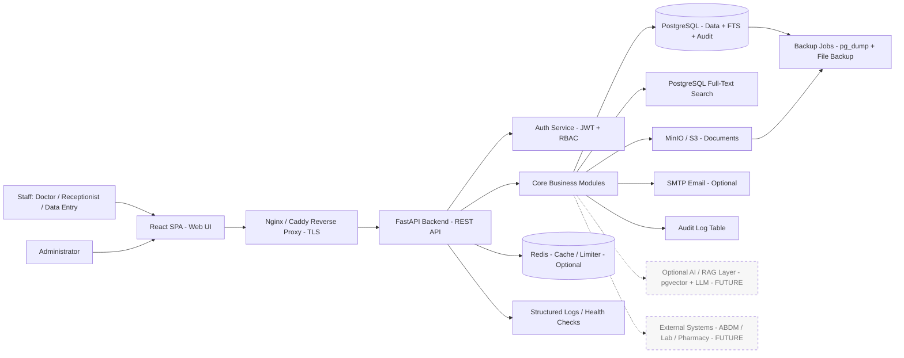
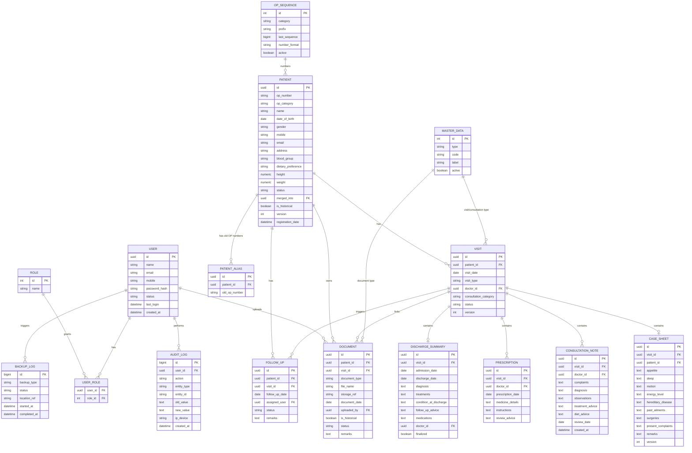
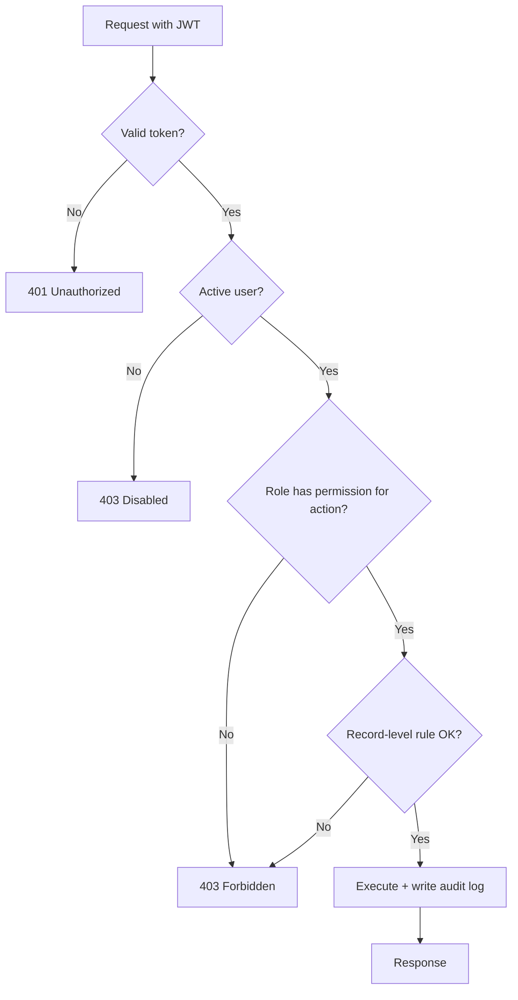
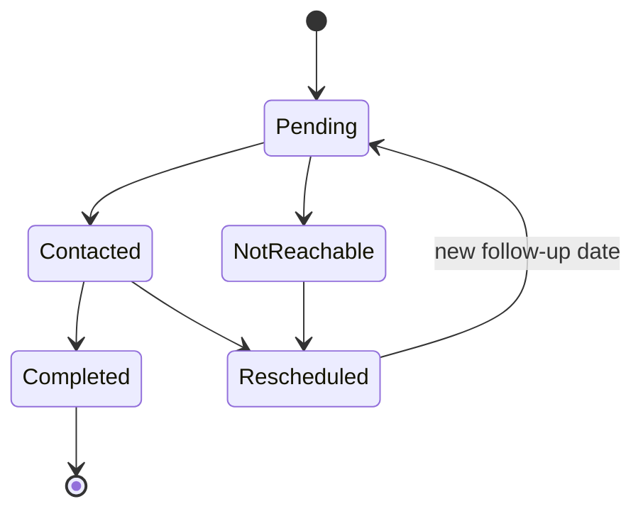
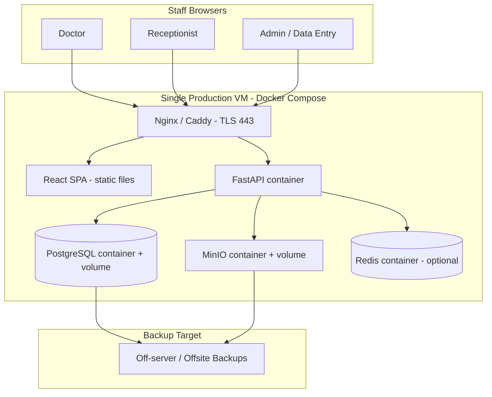

# ArogyaM Patient Management System — System Architecture Document

**Document Type:** System Architecture Document (SAD)
**Application:** ArogyaM Patient Management System (PMS)
**Phase:** Phase 1 (Internal Operational System)
**Version:** 1.0
**Date:** 2026-06-04
**Status:** For Review
**Source Reference:** `Docs/usecases.md` (Phase 1 Detailed Use Case Document)

**Intended Audience:** Business Stakeholders · Project Managers · Technical Architects · Developers · DevOps Team · Security Reviewers

> **Guiding principle for this document:** ArogyaM Phase 1 is a single-clinic, low-concurrency, internal-staff application. The architecture is deliberately kept **simple, minimal, and cost-conscious**. We separate **MVP**, **Full-Scope/Production**, and **Future** so the team does not over-build the first release. Anything not strictly required for Phase 1 is explicitly deferred.

---

## 1. Executive Summary

### 1.1 Purpose of the Solution
ArogyaM PMS is a secure, web-based patient (care seeker) record management system for the internal operational use of ArogyaM staff and doctors. It replaces manual, paper-based case-sheet handling with a structured digital system covering registration, OP number generation, consultation records, prescriptions, discharge summaries, document uploads, search, follow-up tracking, audit trail, and backup.

### 1.2 Business Context
ArogyaM currently relies on paper-based and scattered records, making patient history retrieval slow and historical case sheets (from 2022 onward) hard to access. Phase 1 establishes a reliable digital foundation focused purely on internal operations — public-facing registration, appointments, reminders, and integrations are intentionally postponed to later phases.

### 1.3 Key Business Problems Addressed
| # | Problem | How the System Addresses It |
|---|---------|------------------------------|
| 1 | Slow retrieval of patient history | Fast search by OP number, mobile, name + chronological timeline |
| 2 | Manual, error-prone OP numbering | Transaction-safe, category-wise automatic OP number generation |
| 3 | Lost / scattered paper records | Centralized document storage with secure linking to patient profile |
| 4 | No accountability over record access | Audit trail of create/view/update/upload/export/merge/login |
| 5 | Duplicate patient records | Duplicate detection + Administrator-controlled merge |
| 6 | Risk of data loss | Scheduled database and document backups with restore procedure |
| 7 | Uncontrolled access to sensitive data | Role-based access control and access-controlled documents |

### 1.4 Expected Benefits
- Faster, more reliable patient record retrieval during consultations.
- Preservation and digitization of historical case records.
- Clear accountability through auditing.
- Reduced dependency on physical paper handling.
- A secure, maintainable foundation for future phases (portals, appointments, AI, integrations).

### 1.5 Target Users / Stakeholders
| Stakeholder | Interest |
|-------------|----------|
| Administrator | System configuration, users, master data, audit, backup, reporting |
| Doctor | Patient history, consultation notes, prescriptions, discharge summaries, follow-ups |
| Receptionist / Front Office | Registration, search, visits, demographic updates, document upload |
| Medical Records / Data Entry Staff | Historical record digitization, scanned uploads, linking |
| Management | Operational visibility via dashboards/reports |

### 1.6 High-Level Solution Summary
A **single deployable web application** built as a **React SPA frontend** + **FastAPI REST backend** + **PostgreSQL database**, with **object storage (MinIO/S3)** for uploaded documents and **JWT authentication**. The entire stack runs as a small set of **Docker containers on a single modest server (VM)**. Redis is included as an optional lightweight cache/limiter. Search uses **PostgreSQL full-text search** (no separate search engine). The design is monolithic-but-modular for MVP, with clear seams that allow scaling out later without rewrites.

---

## 2. Scope, Assumptions, Constraints, and Dependencies

### 2.1 In-Scope Modules (Phase 1)
1. User & Access Management (login, roles, RBAC)
2. Patient Registration & Profile Management
3. OP Number Management (category-wise, transaction-safe)
4. Search & Retrieval
5. Visit & Consultation Management (visits, case sheets, consultation notes)
6. Medical Record Management (prescriptions, discharge summaries, document uploads)
7. Historical Record Digitization (2022 onward)
8. Duplicate Detection & Controlled Merge
9. Follow-Up Tracking
10. Dashboard & Basic Reports / Export
11. Audit Trail
12. Backup & Recovery
13. Master Data Management
14. Concurrency / Data Conflict Handling

### 2.2 Out-of-Scope (Phase 1 — deferred to future phases)
Public online registration, public appointment booking, patient portal, SMS/WhatsApp reminders, payment collection, full ABDM/ABHA integration, AI-based OCR extraction, advanced analytics, mobile app, teleconsultation video, pharmacy/inventory, and laboratory integration.

### 2.3 MVP Scope (first release — "Must Have")
Login & RBAC · Patient registration · OP number generation · Patient search · Patient profile · Visit creation · Case sheet entry · Consultation notes · Prescription entry/upload · Discharge summary entry/upload · Document upload · Patient timeline · Follow-up tracking · Audit trail · Backup.

### 2.4 Full-Scope (Phase 1 complete — "Should/Could Have")
Duplicate detection & merge · Basic dashboard · Basic reports · Export · Master data configuration · PDF generation · Advanced search filters · Document preview · Bulk historical import template.

### 2.5 Future Scope
See **Section 24** (portals, appointments, notifications, AI summarization, semantic search, lab/pharmacy/telemedicine integrations, multi-branch).

### 2.6 Assumptions
| # | Assumption |
|---|-----------|
| A1 | Single ArogyaM branch/location in Phase 1 (no multi-tenancy required). |
| A2 | Concurrent active users are low (assumed ≤ 15–20; peak ≤ 30). To be confirmed. |
| A3 | Total patient volume is modest (assumed tens of thousands of records over years). To be confirmed. |
| A4 | Users are internal staff on a trusted network or VPN/HTTPS; no anonymous public access. |
| A5 | Document uploads are small (PDF/JPG/PNG, typically < 10 MB each). To be confirmed. |
| A6 | Hosting is a single Linux VM (cloud or on-premise) with Docker; Kubernetes not required for Phase 1. |
| A7 | Email is the only notification channel needed in Phase 1 (and even that is minimal/optional). |
| A8 | Data retention and compliance follow Indian healthcare data norms; specifics to be confirmed. |
| A9 | A technical/DevOps person is available for backup verification and restore. |

### 2.7 Constraints
- **Minimal hardware/infrastructure** is a hard requirement — favor a single-server Docker deployment.
- Avoid heavyweight components (no Elasticsearch, no Kafka, no Kubernetes in MVP).
- Budget-conscious: prefer open-source, self-hostable components (MinIO over paid S3 if on-premise).
- Non-technical staff are primary users — UI simplicity is mandatory.

### 2.8 Dependencies
| Dependency | Type | Notes |
|------------|------|-------|
| Linux host VM + Docker/Docker Compose | Infrastructure | Required |
| PostgreSQL | Data | Core datastore |
| MinIO or AWS S3 | Storage | Document storage |
| SMTP provider (optional) | External | Backup alerts / minimal email |
| TLS certificate (Let's Encrypt) | Security | HTTPS termination |
| Backup target (separate disk / object bucket / offsite) | Operations | For DR |

---

## 3. Architecture Goals and Principles

| Principle | How It Is Applied in ArogyaM Phase 1 |
|-----------|---------------------------------------|
| **Scalability** | Modular monolith that can be vertically scaled now and split into services later. PostgreSQL and object storage chosen because they scale beyond Phase 1 needs. |
| **Security by Design** | JWT auth, RBAC, hashed passwords, HTTPS, access-controlled (pre-signed/proxied) documents, input validation, audit logging of sensitive actions. |
| **Modular Architecture** | Backend organized into clear modules (auth, patient, visit, clinical, documents, follow-up, audit, reports) with separated routers/services/repositories. |
| **API-First Design** | All functionality exposed through versioned REST APIs; React UI consumes only documented APIs (OpenAPI auto-generated by FastAPI). |
| **Maintainability** | Single codebase, conventional structure, typed models (Pydantic/SQLAlchemy), automated migrations (Alembic). |
| **Observability** | Structured application logs, request logging, health checks, audit trail; lightweight metrics optional. |
| **Performance Optimization** | DB indexing on search keys (OP number, mobile, name), full-text search, pagination, optional Redis caching. |
| **Cloud / On-Premise Readiness** | Fully containerized; runs identically on a cloud VM or an on-premise server. |
| **Cost-Conscious Design** | Single VM, open-source stack, no redundant managed services in MVP. |
| **AI-Readiness** | Data model and document store are structured so future OCR/RAG/semantic search can be layered on without redesign (AI is **optional / future**, not MVP). |

---

## 4. Proposed Technology Stack with Reason for Selection

| Layer | Recommended Technology | Purpose | Reason for Selection | MVP / Future / Optional |
|-------|------------------------|---------|----------------------|--------------------------|
| Frontend | **React** (Vite + TypeScript), component library (e.g. MUI) | Staff-facing web UI | Specified; rich ecosystem, fast to build forms/timelines | MVP |
| Backend | **FastAPI** (Python) + Pydantic + SQLAlchemy + Alembic | Business logic & REST APIs | Specified; high productivity, async, auto OpenAPI docs | MVP |
| API Style | **REST** over HTTPS | Client-server contract | Specified; simple, well-understood, fits CRUD-heavy app | MVP |
| API Gateway / Reverse Proxy | **Nginx** (or Caddy/Traefik) | TLS termination, routing, static serving | Lightweight; single-node ingress; auto-TLS with Caddy/Traefik | MVP |
| Authentication | **JWT** (access + refresh) with bcrypt/argon2 password hashing | Auth & session | Specified; stateless, simple for single service | MVP |
| Database | **PostgreSQL 15+** | Primary relational store | Specified; ACID, robust full-text search, JSONB flexibility | MVP |
| Cache / Limiter | **Redis** | Caching, rate limiting, optional token denylist | Specified; lightweight; optional in MVP | Optional (MVP-light) / Full-Scope |
| Search | **PostgreSQL Full-Text Search** (`tsvector` + GIN, `pg_trgm` for fuzzy/partial) | Patient & document search | Specified; avoids a separate search engine; sufficient at this scale | MVP |
| File / Object Storage | **MinIO** (on-prem) or **AWS S3** (cloud) | Document/file storage | Specified; S3-compatible, decouples files from app/DB, scalable | MVP |
| Queue / Messaging | **Redis (RQ)** or FastAPI background tasks | Async jobs (backup trigger, PDF gen) | Avoid heavyweight brokers; reuse Redis | Optional / Future |
| Notification | **SMTP email** (e.g. transactional email/SMTP relay) | Backup alerts, minimal email | Minimal need in Phase 1; SMS/WhatsApp deferred | Optional / Future |
| Reporting / Analytics | **PostgreSQL queries/views** + server-side export (CSV/Excel/PDF) | Basic operational reports | No BI tool needed at this scale | MVP (basic) / Future (BI) |
| AI / ML / RAG | **Optional** — pgvector + external/local LLM (future) | OCR, summarization, semantic search | Not in Phase 1 scope; data kept AI-ready | Future / Optional |
| Logging / Monitoring | Structured logs (JSON) + **Docker logs**; optional **Prometheus/Grafana** or **Uptime Kuma** | Operations visibility | Start minimal; add stack only if needed | MVP (basic) / Full-Scope |
| Deployment | **Docker + Docker Compose** | Packaging & runtime | Specified; single-node, reproducible, minimal infra | MVP |
| CI/CD | **GitHub Actions** (or GitLab CI) | Build, test, image, deploy | Repo already on GitHub; free for small teams | MVP (basic) |
| Migrations | **Alembic** | Schema versioning | Standard with SQLAlchemy | MVP |
| Backups | `pg_dump`/`pg_basebackup` + object/file backup + cron | DR | Simple, reliable, scriptable | MVP |

---

## 5. High-Level Architecture Overview

The system is a **modular monolith** deployed as a small set of containers behind a reverse proxy.

- **User-Facing Application:** A single React SPA used by all internal roles. Screens follow the use-case menu (Dashboard, Patient Search, Registration, Patient Profile tabs, Follow-Up Register, Documents Register, Reports).
- **Admin Console:** Not a separate app in MVP — admin features (User Management, Master Data, Backup Status, Audit Logs) are **role-gated screens within the same React SPA**, visible only to Administrators.
- **Backend API Layer:** FastAPI exposing versioned REST endpoints, grouped by module. Handles validation, business rules (OP numbering, duplicate detection, conflict handling), and orchestration.
- **Authentication & Authorization:** JWT-based login; middleware validates tokens and enforces role/permission checks per endpoint and per record.
- **Business Services/Modules:** Patient, OP-numbering, Visit, Case Sheet, Consultation, Prescription, Discharge Summary, Document, Follow-Up, Duplicate/Merge, Reports, Master Data, Audit.
- **Database Layer:** PostgreSQL holds all structured data, audit logs, OP sequences (with row locking), and full-text search indexes.
- **File Storage:** MinIO/S3 stores uploaded documents; only **metadata** (path, type, uploader) lives in PostgreSQL. Files are never publicly exposed — access goes through permission checks (proxied download or short-lived pre-signed URLs).
- **Search Layer:** PostgreSQL full-text + trigram indexes for OP/mobile/name/partial search; access-filtered before returning results.
- **Notification Layer:** Minimal — email for backup alerts (optional). No SMS/WhatsApp in Phase 1.
- **Reporting Layer:** SQL-driven aggregations and server-generated export files (CSV/Excel; PDF optional).
- **External Integrations:** None required in Phase 1 (ABDM, lab, pharmacy deferred).
- **Optional AI/ML/RAG Layer:** Not deployed in Phase 1; architecture leaves room (pgvector, document text store) for later.
- **Audit & Observability Layer:** Audit-log table for business actions; structured app logs, request logs, and health endpoints for operations.

---

## 6. Mermaid Architecture Diagram

> Dashed components (AI/RAG, External Systems) are **future**, not part of Phase 1.

---

## 7. Module-wise Architecture

### 7.1 User & Access Management
- **Purpose:** Manage internal users, login, roles, permissions.
- **Key Responsibilities:** Create/edit/disable users, assign roles, reset passwords, enforce active-only login, session timeout.
- **Main Features:** Login (UC-01), user CRUD (UC-02), role assignment, password reset.
- **APIs:** `POST /auth/login`, `POST /auth/refresh`, `POST /auth/logout`, `GET/POST/PUT /users`, `GET /roles`.
- **Entities:** `users`, `roles`, `user_roles` (or role FK), `audit_log`.
- **Security:** Hashed passwords, JWT, RBAC, audit of user-management and login events; no username enumeration on failed login.
- **Integration Dependencies:** None.
- **Classification:** **MVP**.

### 7.2 Role & Access Control (RBAC)
- **Purpose:** Enforce the use-case permission matrix.
- **Responsibilities:** Map roles → permissions; enforce per-endpoint and per-record access; gate UI elements.
- **Features:** Role-based menu, field-level visibility (e.g., receptionist limited medical view).
- **APIs:** Embedded in auth dependency layer; `GET /me/permissions`.
- **Entities:** `roles`, `permissions` (or static permission map), `user_roles`.
- **Security:** Central authorization dependency; deny-by-default.
- **Classification:** **MVP**.

### 7.3 Dashboard
- **Purpose:** Role-based operational snapshot (UC-22).
- **Responsibilities:** Show recent registrations, today's visits, pending/upcoming follow-ups, recent uploads, patient count by OP category.
- **Features:** Role-filtered widgets; click-through to detail.
- **APIs:** `GET /dashboard/summary`.
- **Entities:** Aggregates over `patients`, `visits`, `follow_ups`, `documents`.
- **Security:** Role-filtered aggregation.
- **Classification:** **MVP (basic)**.

### 7.4 Master Data Management
- **Purpose:** Configure reusable values (UC-28).
- **Responsibilities:** Manage consultation categories, OP prefixes, doctor list, document types, visit types, follow-up statuses, blood groups, dietary preferences.
- **Features:** Add/update/deactivate values; duplicate validation; inactive values hidden from new records but preserved in old.
- **APIs:** `GET/POST/PUT /master-data/{type}`.
- **Entities:** `master_data` (typed lookup) or per-type tables; `op_sequence`.
- **Security:** Admin-only; audited.
- **Classification:** **MVP** (categories/prefixes/doctors needed early) / config UI may be **Full-Scope**.

### 7.5 Patient Registration & Profile (Core)
- **Purpose:** Register care seekers, manage demographics (UC-03, UC-06, UC-07).
- **Responsibilities:** Capture demographics, trigger OP generation, duplicate check on create, profile view/edit by role.
- **Features:** Registration form, profile tabs, edit with audit of old/new values.
- **APIs:** `POST /patients`, `GET /patients/{id}`, `PUT /patients/{id}`, `GET /patients/{id}/timeline`.
- **Entities:** `patients`, `op_sequence`, `audit_log`.
- **Security:** Permission-gated; profile access logged; OP number immutable except controlled admin correction.
- **Classification:** **MVP**.

### 7.6 OP Number Management
- **Purpose:** Generate unique, category-wise OP numbers (UC-04).
- **Responsibilities:** Resolve prefix by category, fetch+increment sequence under row lock, ensure transaction-safety and no reuse.
- **Features:** Configurable prefix/format; per-category independent sequence.
- **APIs:** Internal to registration transaction (not a public mutating endpoint).
- **Entities:** `op_sequence` (locked row per category).
- **Security:** `SELECT ... FOR UPDATE` within DB transaction; audited.
- **Classification:** **MVP**.

### 7.7 Search & Retrieval
- **Purpose:** Locate patients quickly (UC-05).
- **Responsibilities:** Search by OP number, mobile, exact/partial name; return minimal identifiers; log profile access.
- **Features:** Partial name (trigram), multi-criteria filter, paginated results.
- **APIs:** `GET /patients/search?q=&op=&mobile=&name=`.
- **Entities:** `patients` (+ FTS/trigram indexes), `audit_log`.
- **Security:** No medical data in result list; access logged on profile open.
- **Classification:** **MVP**.

### 7.8 Visit & Consultation Management
- **Purpose:** Record encounters, case sheets, consultation notes (UC-08, UC-09, UC-10).
- **Responsibilities:** Create visits, structured online case sheet, doctor notes; link to timeline; preserve history (no overwrite).
- **Features:** Visit types, case sheet form, consultation notes with review date.
- **APIs:** `POST /patients/{id}/visits`, `POST /visits/{id}/case-sheet`, `POST /visits/{id}/consultation-notes`.
- **Entities:** `visits`, `case_sheets`, `consultation_notes`.
- **Security:** Clinical entries restricted to doctor/authorized roles; versioned/audited; date/time stamped.
- **Classification:** **MVP**.

### 7.9 Medical Record Management (Prescriptions, Discharge, Documents)
- **Purpose:** Manage prescriptions, discharge summaries, and uploaded documents (UC-11 to UC-16, UC-30).
- **Responsibilities:** Create structured prescriptions/discharge summaries; upload & link files; validate type/size; secure access; historical tagging.
- **Features:** Structured entry + scanned upload; document categories; immutability of finalized discharge summaries (controlled amendment); soft-delete.
- **APIs:** `POST /visits/{id}/prescriptions`, `POST /visits/{id}/discharge-summary`, `POST /patients/{id}/documents`, `GET /documents/{id}` (permission-checked download).
- **Entities:** `prescriptions`, `discharge_summaries`, `documents`.
- **Security:** No public URLs; permission check + access logging; file-type/size validation; optional malware scan.
- **Classification:** **MVP** (structured PDF export is **Could-Have/Full-Scope**).

### 7.10 Follow-Up Tracking
- **Purpose:** Track reviews and action items (UC-20, UC-21).
- **Responsibilities:** Create follow-ups, update status (Pending/Contacted/Completed/Rescheduled/Not reachable), surface in dashboard.
- **APIs:** `POST /patients/{id}/follow-ups`, `PUT /follow-ups/{id}`.
- **Entities:** `follow_ups`.
- **Security:** Cannot be deleted by normal users; updates audited.
- **Classification:** **MVP**.

### 7.11 Duplicate Detection & Merge
- **Purpose:** Detect and safely merge duplicates (UC-18, UC-19).
- **Responsibilities:** Suggest duplicates (mobile exact = high confidence; name = possible); admin-only merge moving visits/documents to primary; mark duplicate inactive (not deleted); retain old OP numbers as aliases.
- **APIs:** `GET /patients/duplicates`, `POST /patients/merge` (admin).
- **Entities:** `patients` (status, merged_into), `patient_aliases`, `audit_log`.
- **Security:** Merge admin-only, confirmation required, fully audited, irreversible via normal UI.
- **Classification:** Detection **Full-Scope (Should-Have)**; Merge **Full-Scope**.

### 7.12 Reports & Analytics
- **Purpose:** Basic operational reports and exports (UC-23, UC-24).
- **Responsibilities:** Registration/visit/follow-up/OP-category/document reports with date ranges; export with generated-by/date metadata.
- **APIs:** `GET /reports/{type}?from=&to=`, `POST /patients/{id}/export`.
- **Entities:** Aggregate views; `audit_log` for exports.
- **Security:** Role-restricted; exports of patient-level data audited.
- **Classification:** **Full-Scope (Should-Have)**.

### 7.13 Audit Trail
- **Purpose:** Record sensitive actions (UC-25).
- **Responsibilities:** Capture user/role/action/entity/old-new/time/IP for create/view/update/upload/export/merge/login.
- **APIs:** `GET /audit-logs` (admin, filterable).
- **Entities:** `audit_log` (append-only).
- **Security:** Not editable by normal users; admin review only.
- **Classification:** **MVP**.

### 7.14 Backup & Recovery
- **Purpose:** Protect data and documents (UC-26, UC-27).
- **Responsibilities:** Scheduled DB + document backup, verify completion, record status, alert on failure; controlled restore.
- **APIs:** `GET /backup/status` (admin); restore performed via ops procedure, not UI.
- **Entities:** `backup_log`.
- **Security:** Restore by authorized technical personnel only; activity logged.
- **Classification:** **MVP**.

### 7.15 Concurrency / Data Conflict Handling
- **Purpose:** Prevent lost updates and duplicate OP numbers (UC-29).
- **Responsibilities:** Optimistic concurrency (row `version`/`updated_at`) on patient/clinical records; transactional row lock for OP sequence.
- **Security/Integrity:** Conflict warning forces reload before save; clinical records never silently overwritten.
- **Classification:** **MVP**.

---

## 8. Data Architecture and Mermaid ERD

### 8.1 Data Architecture Notes
- **Single PostgreSQL database**, normalized relational model.
- **Master / lookup tables:** `roles`, `master_data` (categories, document types, visit types, follow-up statuses, blood groups, dietary prefs), `op_sequence`.
- **Core entity:** `patients` (with `op_number`, `op_category`, status, `merged_into`).
- **Transactional tables:** `visits`, `case_sheets`, `consultation_notes`, `prescriptions`, `discharge_summaries`, `follow_ups`.
- **File metadata table:** `documents` (file path/reference in MinIO/S3, type, uploader, historical flag). Binary files live in object storage, **not** in the DB.
- **Audit/log tables:** `audit_log` (append-only), `backup_log`.
- **Configuration tables:** `master_data`, `op_sequence`.
- **Reporting/analytics:** SQL views over existing tables (no separate analytics DB in Phase 1).
- **Multi-tenancy:** Not required (single branch). A `branch_id` column may be added later for multi-branch without restructuring.
- **Concurrency:** `version`/`updated_at` columns on mutable clinical records; `op_sequence` locked per category.
- **Soft delete:** `status`/`is_active` flags rather than physical deletes for patients/documents.

### 8.2 Mermaid ERD

---

## 9. API Architecture and API Groups

### 9.1 Design Approach
- **Style:** REST over HTTPS, JSON. (gRPC/GraphQL not justified at this scale.)
- **Documentation:** Auto-generated OpenAPI/Swagger from FastAPI.
- **Versioning:** URL prefix `/api/v1/...`.
- **Auth:** Bearer JWT (access token); refresh-token endpoint; RBAC enforced via a central FastAPI dependency.
- **Error Handling:** Consistent error envelope `{ "error": { "code", "message", "details" } }` with proper HTTP status codes; validation errors return field-level detail.
- **Request/Response Standard:** snake_case JSON; ISO-8601 timestamps; UUID identifiers.
- **Pagination/Sorting/Filtering:** `?page=&page_size=&sort=&order=` plus resource-specific filters; envelope includes `total`, `page`, `page_size`.
- **File Upload/Download:** Multipart upload with server-side type/size validation; downloads via permission-checked proxy endpoint or short-lived pre-signed URL.
- **Audit:** Sensitive endpoints (view profile, upload, export, merge, login, user changes) write to `audit_log`.
- **Rate Limiting:** Optional via Redis (login throttling).

### 9.2 API Groups
| Group | Example Endpoints | Notes |
|-------|-------------------|-------|
| Auth | `POST /auth/login`, `/auth/refresh`, `/auth/logout`, `GET /me` | JWT issuance; login audited |
| User | `GET/POST/PUT /users`, `PUT /users/{id}/status`, `POST /users/{id}/reset-password` | Admin-only |
| Role/Permission | `GET /roles`, `GET /me/permissions` | RBAC |
| Master Data | `GET/POST/PUT /master-data/{type}` | Admin-only, audited |
| Patient | `POST/GET/PUT /patients`, `GET /patients/{id}/timeline` | Core; access logged |
| Search | `GET /patients/search` | Partial/full-text, paginated |
| Visit/Workflow | `POST /patients/{id}/visits`, `POST /visits/{id}/case-sheet`, `/consultation-notes` | Clinical RBAC |
| Clinical | `POST /visits/{id}/prescriptions`, `/discharge-summary` | Doctor/authorized only |
| Document | `POST /patients/{id}/documents`, `GET /documents/{id}` | Validated upload, secured download |
| Follow-Up | `POST /patients/{id}/follow-ups`, `PUT /follow-ups/{id}` | Dashboard-linked |
| Duplicate/Merge | `GET /patients/duplicates`, `POST /patients/merge` | Admin merge |
| Dashboard | `GET /dashboard/summary` | Role-filtered |
| Report | `GET /reports/{type}`, `POST /patients/{id}/export` | Audited exports |
| Audit | `GET /audit-logs` | Admin read-only |
| Backup | `GET /backup/status` | Admin |
| Integration | — | None in Phase 1 (future) |

---

## 10. Security Architecture

| Area | Approach |
|------|----------|
| **Authentication** | JWT access token (short-lived) + refresh token; bcrypt/argon2 password hashing; active-only login. |
| **Authorization** | Central RBAC dependency; deny-by-default; per-endpoint and per-record checks following the permission matrix. |
| **RBAC** | Roles: Administrator, Doctor, Receptionist, Data Entry Staff. Permissions mapped from UC §4 matrix. |
| **ABAC** | Limited attribute checks (e.g., receptionist sees limited medical fields); not a full ABAC engine in MVP. |
| **MFA** | Not required in Phase 1 (internal users). Deferred (admin MFA recommended for future). |
| **Token Management** | Short access TTL; refresh rotation; optional Redis denylist for logout/revocation. |
| **Session Management** | Inactivity timeout (configurable); token expiry enforced server-side. |
| **API Security** | HTTPS-only, input validation (Pydantic), CORS locked to the SPA origin, rate limiting on auth. |
| **Input Validation** | Strict schema validation; parameterized queries via SQLAlchemy (no string SQL) to prevent injection. |
| **File Upload Security** | Allow-list PDF/JPG/JPEG/PNG; size limit; content-type sniffing; store outside web root in object storage; optional AV scan. |
| **Encryption in Transit** | TLS 1.2+ at reverse proxy (Let's Encrypt). |
| **Encryption at Rest** | DB volume + object-store encryption (filesystem/disk encryption or MinIO/S3 SSE). |
| **Secrets Management** | Environment variables / Docker secrets / `.env` excluded from VCS; no secrets in code. |
| **Audit Logging** | All sensitive actions logged; append-only; admin-reviewable. |
| **Admin Activity Tracking** | User management, master data, merges, restores all audited. |
| **Log Privacy (PII/PHI)** | Application/operational logs must **never** contain patient PII/PHI. Field-level redaction, allow-listed structured fields, no request/response body logging on clinical endpoints, debug/SQL-echo disabled in prod, proxy query-string redaction. See **§10.1**. |
| **Secure Configuration** | Hardened containers, least-privilege DB user, disabled debug in prod, secure headers via proxy. |
| **OWASP Best Practices** | Addresses Top 10: injection, broken auth, access control, sensitive data exposure, misconfig, etc. |
| **Compliance** | Align with applicable Indian health-data norms (DPDP Act); data minimization, access logging, retention policy (to be confirmed — see Open Questions). |

### 10.1 Log Privacy — Preventing PII/PHI in Application Logs

**Principle:** The **audit log** (`audit_log` table) is the *only* place permitted to hold patient-identifying or clinical detail, and it is access-controlled and admin-only. All other logs — application logs, request logs, error/stack traces, reverse-proxy access logs, and any external monitoring — are treated as **lower-trust** and must be free of PII/PHI. This is both a security control and a **DPDP §8(5)** safeguard.

**What counts as PII/PHI here (must be redacted/omitted from non-audit logs):** patient name, mobile, email, address, date of birth/age, gender, OP number, blood group, height/weight, any clinical free-text (complaints, diagnosis, notes, prescriptions, discharge summaries, case-sheet fields), uploaded file names/contents, and search terms that contain the above.

| # | Control | Implementation |
|---|---------|----------------|
| 1 | **Allow-list structured logging** | Log only an explicit set of non-identifying fields: `request_id` (correlation ID), `user_id`, `role`, HTTP method, **route template** (`/patients/{id}`, not the resolved value), status code, latency. Never serialize whole request/response bodies or ORM model instances. |
| 2 | **Central redaction filter** | A logging filter/processor (e.g., Python `logging.Filter` / structlog processor) masks a configured set of sensitive keys (`name`, `mobile`, `email`, `address`, `dob`, `op_number`, clinical fields, `q`/search params) to `***REDACTED***` before any log record is emitted — a safety net even if a developer logs an object by mistake. |
| 3 | **No request/response bodies on clinical & patient endpoints** | Body logging is disabled by default; if a body is ever logged for debugging, it passes through the redaction filter. Multipart uploads log only metadata (content-type, size), never file content or original filename in plaintext. |
| 4 | **Search terms never logged in plaintext** | `GET /patients/search` query parameters (name/mobile/OP) are omitted or one-way hashed in logs; only result count and latency are recorded. |
| 5 | **Debug & SQL echo disabled in production** | SQLAlchemy `echo=False` in prod (SQL parameter logging would expose PHI); framework debug mode off; verbose tracebacks not returned to clients. |
| 6 | **Exception/error handling** | The global exception handler returns a generic error envelope with the `request_id` to the client; internally it logs the exception **type + stack trace + request_id only** — not the request body or entity values. Correlate to the audit log via `request_id` when investigation needs the actual record. |
| 7 | **Reverse-proxy (Nginx/Caddy) access logs** | Configure the proxy log format to **drop query strings** (or anonymize them) for patient/search routes, since default access logs capture full URLs including PII in query params. Prefer logging the path without query string. |
| 8 | **External monitoring (if adopted)** | Error/monitoring tools (e.g., Sentry) are enabled only with PII scrubbing / `send_default_pii=false` and `before_send` redaction; covered by a processor contract (DPDP §8(2)). |
| 9 | **Log storage, access & retention** | Logs stored with restricted OS/file permissions; retained for **≥ 1 year** (DPDP draft-Rules security-log expectation) then rotated/purged. Audit log retention follows the organizational/legal policy (see Open Questions). |

**Validation:** Add a lightweight test/lint step in CI that scans log output of representative patient/clinical requests and fails if any known PII pattern (e.g., a seeded test mobile number or name) appears in non-audit log streams.

---

## 11. User, Role, and Access Control Architecture

### 11.1 User Types
Internal staff only: Administrator, Doctor, Receptionist, Data Entry Staff. No external/patient users in Phase 1.

### 11.2 Role Types & Permission Model
RBAC driven by the use-case permission matrix (UC §4). Permissions are coarse-grained actions (create_patient, view_medical_history, add_consultation, merge_records, manage_users, view_audit, backup_control, etc.) mapped to roles. UI hides unauthorized actions; backend enforces authoritatively.

| Capability (sample) | Admin | Doctor | Receptionist | Data Entry |
|---------------------|:-----:|:------:|:------------:|:----------:|
| Manage users / view audit / backup | ✅ | ❌ | ❌ | ❌ |
| Create/edit patient | ✅ | Limited | ✅ | Limited |
| Add consultation/prescription | Optional | ✅ | ❌ | ❌ |
| Merge duplicates | ✅ | ❌ | Request | Request |
| View full medical history | ✅ | ✅ | Limited | Limited |
| Upload documents | ✅ | ✅ | ✅ | ✅ |

### 11.3 Access Control Flow

### 11.4 Admin Privileges
User management, master data, merges, audit review, backup/restore control, and corrections (e.g., OP number) are Administrator-only and audited.

### 11.5 Approval / Moderation Flow
Limited in Phase 1: receptionist/data-entry can **request** a merge; Administrator approves and executes. No multi-level approval workflow otherwise.

### 11.6 Organization / Tenant-Level Access
Single organization, single branch — not applicable in Phase 1.

---

## 12. Workflow Architecture

Phase 1 has lightweight lifecycle workflows rather than complex multi-approval flows. The two notable ones are the **Follow-Up lifecycle** and the **Duplicate Merge** process.

### 12.1 Follow-Up State Diagram

### 12.2 Duplicate Merge Process
- States: **Suggested → Reviewed → MergeRequested → Merged (primary retained, duplicate inactive)**.
- Reviewer/moderator: Receptionist/Data Entry can request; Administrator confirms/executes.
- Escalation: None automated; merges are manual and audited.
- Notifications: Not required in Phase 1.
- Audit: Full before/after merge audit retained.
- Configurable workflow: Not in Phase 1.

### 12.3 Discharge Summary Lifecycle
Draft → Finalized (immutable; controlled amendment creates an audited new version).

---

## 13. Search Architecture

| Capability | Phase 1 Approach |
|------------|-------------------|
| Keyword search | OP number, mobile, name via indexed queries |
| Full-text search | PostgreSQL `tsvector` + GIN index on patient name/identifiers |
| Partial / fuzzy | `pg_trgm` trigram index for partial name and typo tolerance |
| Filter-based | Filter by mobile, age, address, visit date, OP category |
| Advanced search | Combine criteria; date ranges (Full-Scope refinement) |
| Faceted search | Not in MVP (optional Full-Scope) |
| Indexing strategy | B-tree on `op_number`/`mobile`; GIN/trigram on name; index `visit_date` |
| Result ranking | Exact OP/mobile match first, then name relevance |
| Access-controlled results | Result list shows only minimal identifiers; medical data requires opening profile (logged) |
| Semantic / vector search | **Future/Optional** via pgvector — not in Phase 1 |

No separate search engine (Elasticsearch/OpenSearch) is deployed — PostgreSQL full-text search is sufficient and keeps infrastructure minimal.

---

## 14. AI/ML/RAG Architecture (Optional — Future)

> **Not part of Phase 1.** AI-based OCR and advanced analytics are explicitly out of scope. This section documents how AI could be added later without redesign. The architecture is kept **AI-ready**.

| Aspect | Future Direction |
|--------|------------------|
| AI use cases | OCR extraction from scanned case sheets; AI-assisted case-history summarization; semantic search |
| Document ingestion | New uploads queued for text extraction (async worker) |
| Text extraction | OCR (e.g., Tesseract) / document AI for scanned PDFs/images |
| Chunking | Per-document/per-visit chunking |
| Embeddings | Generate embeddings (local model or external API) |
| Vector storage | **pgvector** extension in the existing PostgreSQL (no new datastore) |
| Retrieval flow | Hybrid: keyword (FTS) + vector similarity |
| LLM integration | Pluggable — external LLM API **or** local LLM for data-residency |
| Prompt management | Versioned prompt templates |
| Citation-based responses | Summaries must cite source visit/document IDs |
| Human review | All AI clinical output reviewed by a doctor before use |
| Guardrails | No autonomous clinical decisions; PII handling controls |
| AI audit logging | Log prompts, sources, outputs, reviewer |
| Cost / rate limits | Batch/off-peak processing; caps |
| External vs local LLM | Prefer local/self-hosted for patient-data privacy; decision deferred |

---

## 15. Integration Architecture

> **No external integrations are required in Phase 1.** ABDM/ABHA, lab, and pharmacy systems are explicitly out of scope.

For future readiness, the recommended patterns are documented:
- **Patterns:** API-based (REST), webhook/event-based, and batch import (e.g., bulk historical data template — a Could-Have).
- **Auth with external systems:** OAuth2/API keys stored as secrets.
- **Resilience:** Retry with backoff, circuit breaker, idempotency keys.
- **Data transformation:** Adapter layer mapping external schemas to ArogyaM entities.
- **Integration audit logs:** All inbound/outbound integration calls logged.

The only "integration-like" feature in Phase 1 is the **bulk historical record import template** (Could-Have), handled as an internal batch utility, not an external connection.

---

## 16. Notification Architecture

> Notifications are **minimal/optional** in Phase 1. SMS/WhatsApp/email reminders to patients are out of scope.

| Aspect | Phase 1 |
|--------|---------|
| Notification types | Operational only |
| Email | **Optional** — backup success/failure alerts to Administrator via SMTP |
| SMS / WhatsApp | ❌ Future |
| In-app notifications | Dashboard surfacing of pending/upcoming follow-ups (not push) |
| Templates | Simple text for alerts |
| Trigger events | Backup completion/failure |
| Delivery tracking | Basic send log |
| Retry / failure handling | Log and alert; manual follow-up |
| Audit | Backup notifications recorded in `backup_log` |

---

## 17. Reporting and Analytics Architecture

- **Operational reports (UC-24):** Patient registration, visit, follow-up, OP-category, document-upload reports with mandatory date ranges.
- **Dashboard (UC-22):** Recent registrations, today's visits, pending/upcoming follow-ups, recent uploads, patient count by OP category.
- **Role-based dashboards:** Doctors see their clinical follow-ups; receptionists see operational follow-ups; admins see overall stats.
- **Export options:** CSV/Excel in MVP; PDF optional/Could-Have. Exports carry generated-by + date and are audited.
- **Report filters:** Date range, OP category, doctor, status.
- **Aggregation strategy:** Direct SQL aggregation + database **views** (sufficient at this scale). Add **materialized views** only if a report becomes slow.
- **Analytics DB / BI:** Not required in Phase 1.
- **Future:** BI tool (Metabase/Superset) and AI-assisted analytics.

---

## 18. Deployment Architecture with Mermaid Diagram

### 18.1 Approach
**Single Linux VM** running **Docker Compose** with a small set of containers. This satisfies the minimal-hardware constraint while remaining Kubernetes-ready (containers can later move to k8s unchanged).

| Environment | Setup |
|-------------|-------|
| Development | Local Docker Compose; hot reload; seed data |
| Testing / CI | Ephemeral containers in CI pipeline; throwaway DB |
| UAT | Single small VM mirroring prod config (separate DB/bucket) |
| Production | Single VM, Docker Compose, Nginx/Caddy TLS, daily backups |

- **Reverse proxy / ingress:** Nginx or Caddy/Traefik (auto-TLS).
- **SSL/TLS:** Let's Encrypt certificates; HTTPS enforced; HTTP→HTTPS redirect.
- **Environment config:** Per-environment `.env`/Docker secrets; no secrets in images.
- **Scaling approach (Phase 1):** Vertical (more CPU/RAM). Horizontal API scaling is a future step (stateless API behind proxy makes this easy).
- **Backup & restore:** Nightly `pg_dump` + object-store/file backup to a separate volume/offsite bucket; documented and tested restore.
- **DR basics:** Off-server copy of backups; documented restore runbook; periodic restore test.

### 18.2 Deployment Diagram

> For on-premise/cloud parity, MinIO can be swapped for AWS S3 with no code change (S3-compatible API).

---

## 19. DevOps and CI/CD Architecture

- **Branching strategy:** Trunk-based with short-lived feature branches → PR → `main`. Tags for releases.
- **Build pipeline:** GitHub Actions — lint, type-check, unit/integration tests, build frontend, build Docker images.
- **Test pipeline:** Backend (pytest) + frontend tests run on each PR against an ephemeral PostgreSQL.
- **Security scanning:** Dependency scan (e.g., `pip-audit`/Dependabot, `npm audit`), image scan (Trivy), secret scanning.
- **Docker image build:** Versioned, tagged images pushed to a registry (GHCR).
- **Deployment pipeline:** On tag/merge to `main`, pull images on the VM and `docker compose up -d` (or via a simple deploy script / Watchtower). UAT first, then prod.
- **Environment promotion:** Dev → CI → UAT → Production using the same images with different env config.
- **Rollback strategy:** Re-deploy previous image tag; DB rollback via tested backup/migration down-paths (favor forward-fixes).
- **Release management:** Semantic version tags, changelog, migration notes.

---

## 20. Observability Architecture

| Concern | Phase 1 Implementation |
|---------|------------------------|
| Application logging | Structured JSON logs to stdout (collected by Docker); **PII/PHI-redacted per §10.1** (allow-listed fields only) |
| API request logging | Middleware logs `request_id`, method, **route template**, status, latency, user id — **no bodies, no PII query params** (§10.1) |
| Error logging | Exception type + stack trace + `request_id` only; **no request body/entity values**; generic envelope to client; optional Sentry with PII scrubbing (future) |
| Audit logging | Business `audit_log` table — the **only** log permitted to hold patient/clinical detail; access-controlled, separate from app logs |
| Metrics | Optional `/metrics` (Prometheus) — Full-Scope, not MVP |
| Health checks | `/health` (liveness) and `/ready` (DB/storage connectivity) |
| Distributed tracing | Not needed (single service) |
| Alerting | Backup-failure email; basic uptime check (e.g., Uptime Kuma) |
| Monitoring dashboard | Optional Grafana / Uptime Kuma in Full-Scope |

Start minimal (logs + health + backup alerts). Add Prometheus/Grafana only if operational need arises.

---

## 21. Non-Functional Architecture

| Quality | How It Is Addressed |
|---------|---------------------|
| **Scalability** | Stateless API + external DB/storage enable vertical now, horizontal later. |
| **Performance** | Indexed search keys, FTS/trigram, pagination, optional Redis cache; targets fast search and dashboard load. |
| **Security** | See Section 10 (JWT, RBAC, TLS, encryption, validation, audit). |
| **Availability** | Daily operational use on a single VM; backups + documented recovery; restart policies on containers. |
| **Reliability** | ACID transactions, transaction-safe OP numbering, optimistic concurrency, soft deletes. |
| **Maintainability** | Modular monolith, typed models, migrations, automated tests, OpenAPI docs. |
| **Extensibility** | Clear module seams; AI/integration/multi-branch hooks designed but deferred. |
| **Observability** | Structured logs, health checks, audit trail, optional metrics. |
| **Backup & Recovery** | Nightly DB + document backup, offsite copy, tested restore runbook. |
| **Compliance** | Data minimization, access logging, retention policy (to confirm), DPDP alignment. |
| **Usability** | Simple forms mirroring paper case sheets, dashboard-first search, clear mandatory fields. |
| **Accessibility** | Use accessible React components, keyboard navigation, sufficient contrast (baseline WCAG AA target). |
| **Data Privacy** | Role-based field visibility, no public document URLs, audited access/export. |

---

## 22. MVP Architecture

The MVP is the **simplest deployable system** that satisfies the "Must-Have" use cases.

- **Minimum required modules:** Auth+RBAC, Patient registration, OP numbering, Search, Patient profile + timeline, Visit, Case sheet, Consultation notes, Prescription (entry/upload), Discharge summary (entry/upload), Document upload, Follow-up, Audit trail, Backup.
- **Minimum infrastructure:** Single Linux VM running Docker Compose with: React (static) + FastAPI + PostgreSQL + MinIO + Nginx/Caddy. **Redis optional** (can start without it; add for rate limiting/cache when needed).
- **Recommended MVP deployment model:** Single-node Docker Compose, HTTPS via Let's Encrypt, nightly backups to an off-server location.
- **MVP database design:** Normalized PostgreSQL per Section 8; FTS/trigram indexes; `op_sequence` row locking; `version` columns on mutable records.
- **MVP authentication & security:** JWT + hashed passwords, RBAC, HTTPS, input validation, secured document access, audit of sensitive actions.
- **MVP reporting & dashboard:** Basic role-based dashboard (recent registrations, today's visits, pending follow-ups); basic reports can follow immediately after.
- **MVP backup & monitoring:** `pg_dump` + document backup via cron; health checks; backup-failure email alert.
- **Intentionally deferred:** Duplicate merge UI polish, advanced reports/BI, PDF generation, Prometheus/Grafana, Redis-heavy features, AI/OCR, integrations, notifications beyond backup alerts, MFA, multi-branch.

---

## 23. Production / Full-Scale Architecture

When load or criticality grows beyond Phase 1 assumptions, evolve as follows (no rewrite required):

- **High availability:** Run 2+ API replicas behind the proxy; managed/replicated PostgreSQL (primary + standby); MinIO in distributed mode or move to S3.
- **Horizontal scaling:** Scale stateless API containers; introduce Kubernetes if container count/ops warrant it.
- **Load balancing:** Proxy/ingress (Nginx/Traefik) or cloud LB across API replicas.
- **Separate services:** Optionally extract heavy/independent concerns (document processing, reporting, future AI) into separate services/workers.
- **Advanced monitoring:** Prometheus + Grafana dashboards, centralized logging (Loki/ELK), Sentry for errors, alerting.
- **Advanced security:** Admin MFA, WAF at proxy, secret manager (Vault/cloud), periodic pen-testing, finer ABAC.
- **Backup & DR:** Continuous WAL archiving / PITR, cross-region/offsite replicas, documented RTO/RPO, regular DR drills.
- **Performance optimization:** Connection pooling (PgBouncer), Redis caching, materialized views/read replicas for reporting, CDN for static assets.

---

## 24. Future Architecture Enhancements

| Enhancement | Notes |
|-------------|-------|
| Online patient registration | Public web form feeding a moderation queue |
| Appointment management | Slots, doctor calendars |
| Patient portal | Care-seeker self-service login |
| Doctor portal | Dedicated doctor workspace / calendar |
| Mobile application / PWA | Mobile-friendly access |
| Advanced reporting & BI | Metabase/Superset, materialized views |
| AI-assisted case-history summarization | LLM + RAG with citations and human review |
| Semantic / vector search | pgvector hybrid search |
| Lab / pharmacy integration | API-based integrations |
| Telemedicine integration | Video consultation |
| Notifications | Email/SMS/WhatsApp reminders |
| ABDM/ABHA readiness | Health-ID integration |
| Multi-branch support | Add `branch_id` scoping + branch-level access |
| Consent & retention automation | Patient consent management, automated archival |

---

## 25. Risks and Mitigation

| Risk | Impact | Probability | Mitigation |
|------|--------|-------------|------------|
| Unauthorized access to patient data | High | Medium | RBAC, JWT, HTTPS, audit logging, secured documents, least privilege |
| Data privacy / compliance gaps | High | Medium | Data minimization, access logs, retention policy, DPDP alignment (confirm requirements) |
| Low user adoption (non-technical staff) | Medium | Medium | Simple UI mirroring paper forms, training, dashboard-first search |
| Single-VM infrastructure limits / single point of failure | High | Medium | Documented restore, off-server backups; HA path defined for Full-Scale |
| Backup failure / untested restore | High | Medium | Automated backups, failure alerts, scheduled restore tests |
| Poor data quality in historical/migrated records | Medium | High | Mark historical records, approximate dates with remarks, validation, dedup review |
| OP number duplication under concurrency | High | Low | Transaction-safe row-locked sequence generation |
| Lost updates from concurrent edits | Medium | Medium | Optimistic concurrency (version), conflict warning + reload |
| Document storage growth | Medium | Medium | Object storage (scales), size limits, monitoring of disk |
| Scope creep into future-phase features | Medium | High | Strict MVP/Full-Scope/Future separation, change control |
| Performance degradation as data grows | Medium | Low | Indexing, pagination, optional cache, materialized views when needed |
| Limited operational/DevOps support | Medium | Medium | Simple Docker Compose ops, runbooks, monitoring/alerts |
| Malware via uploaded files | Medium | Low | File-type/size validation, store outside web root, optional AV scan |
| PII/PHI leakage via application or proxy logs | High | Medium | Log redaction filter, allow-listed fields, no body/SQL logging in prod, proxy query-string redaction, CI log-scan test (§10.1) |

---

## 26. Architecture Decisions (ADR Summary)

| Decision | Options Considered | Recommended Option | Reason | Impact |
|----------|--------------------|--------------------|--------|--------|
| Application architecture | Microservices vs Modular Monolith | **Modular Monolith** | Low load, small team, minimal infra; faster to build & operate | Simple ops; can split later |
| Deployment platform | Kubernetes vs Docker Compose (single VM) | **Docker Compose on single VM** | Minimal hardware/cost; k8s-ready containers | Low cost; manual HA until scaled |
| Search technology | Elasticsearch vs PostgreSQL FTS | **PostgreSQL FTS + pg_trgm** | Sufficient at scale; no extra service | Lower infra/maintenance |
| File storage | DB BLOBs vs Object storage | **MinIO/S3 object storage** | Keeps DB lean; scalable; secure access | Decoupled, scalable files |
| Authentication | Sessions vs JWT | **JWT (access+refresh)** | Stateless, simple for single API; specified | Easy scaling; needs token hygiene |
| Database | MySQL vs PostgreSQL | **PostgreSQL** | FTS, JSONB, pgvector-ready, robust | Future AI/search ready |
| Cache/queue | RabbitMQ/Kafka vs Redis vs none | **Redis (optional) / none in MVP** | Avoid heavyweight brokers | Minimal footprint |
| Notifications (Phase 1) | Full email/SMS vs minimal | **Minimal (backup alerts only)** | Patient notifications out of scope | Less complexity |
| AI/OCR (Phase 1) | Include vs defer | **Defer (AI-ready design)** | Explicitly out of scope; keep data structured | No MVP cost; future-enabled |
| Multi-tenancy | Build now vs defer | **Defer (single branch)** | Single location in Phase 1 | Add `branch_id` later |
| Reporting | BI tool vs SQL/views | **SQL + views, server export** | Sufficient for basic reports | Add BI later |
| Concurrency control | Pessimistic vs Optimistic | **Optimistic (version) + locked OP sequence** | Low contention; safe numbering | Conflict-aware UX |

---

## 27. Open Questions

1. **Expected number of concurrent users and total staff?** (Confirms sizing assumption ≤15–20 concurrent.)
2. **Expected number of patients / historical records to migrate?** (Storage and indexing planning.)
3. **Which reports are mandatory for Phase 1 go-live?** (Beyond the listed five.)
4. **Exact role list and field-level visibility rules** for receptionist "limited" medical view?
5. **Data retention and deletion policy** (clinical/legal requirement, years to retain)?
6. **Backup frequency, retention window, and off-site location** (daily? hourly? RPO/RTO targets)?
7. **Hosting preference:** cloud (which provider) or on-premise server? (Determines MinIO vs S3, TLS approach.)
8. **Email provider/SMTP details** for backup alerts (and any minimal email needs)?
9. **Is HTTPS-only intranet, VPN, or public internet exposure expected?** (Network security posture.)
10. **Document upload limits** — max file size, expected per-patient volume, virus-scanning requirement?
11. **Compliance expectations** — DPDP Act specifics, any audit/inspection requirements, consent handling?
12. **PDF generation for prescriptions/discharge summaries** — required at launch or deferred?
13. **OP number format details** — exact prefixes, padding width, reset rules (yearly?), and historical preservation rules?
14. **Existing website / future integration details** that should influence Phase 1 data design?
15. **Who performs/owns backups and restores** (in-house DevOps vs vendor support)?

---

## 28. Conclusion

### Recommended Architecture
A **modular monolith** — React SPA + FastAPI REST + PostgreSQL + MinIO/S3 + JWT, deployed as **Docker Compose on a single Linux VM** behind an HTTPS reverse proxy, with PostgreSQL full-text search and optional Redis. This directly satisfies the constraints of **minimal hardware, low user load, and cost-conscious, non-over-engineered MVP**.

### MVP Feasibility
The Must-Have use cases (auth, registration, OP numbering, search, profile/timeline, visits, clinical records, document upload, follow-ups, audit, backup) are fully achievable on the minimal single-VM stack. No heavyweight infrastructure is required to launch.

### Production Readiness Path
The same containers scale to a production-grade setup: API replicas behind a load balancer, replicated PostgreSQL with PITR, distributed/cloud object storage, centralized monitoring/alerting, admin MFA, and DR drills — all without rewriting the application.

### Key Benefits
Secure, accountable, fast patient record management; preservation of historical records; reduced paper dependency; and a clean, AI- and integration-ready foundation for future phases.

### Major Assumptions
Single branch, low concurrency, modest data volume, internal-only users, small document sizes, single-VM Docker hosting, email-only minimal notifications (see Section 2.6). These must be confirmed via the Open Questions.

### Next Steps
1. Confirm Open Questions (Section 27), especially hosting, sizing, retention, and OP number format.
2. Finalize the data model and Alembic migrations.
3. Stand up the Docker Compose dev environment and CI pipeline.
4. Build MVP modules in priority order, then layer Full-Scope features.
5. Configure and **test** backup/restore before go-live.

---

*End of System Architecture Document — ArogyaM Patient Management System (Phase 1), v1.0.*
